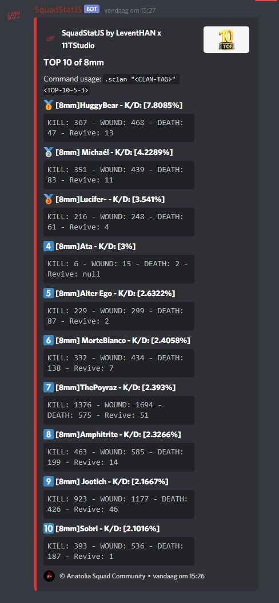
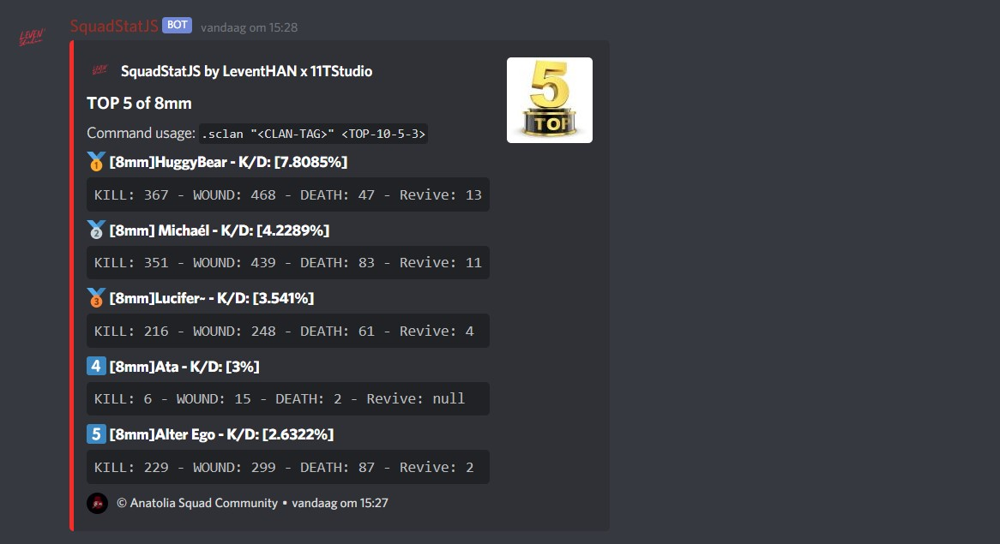
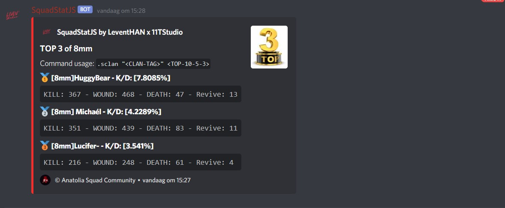

<div align="center">


#### SquadStatJS
[](https://github.com/11TStudio/SquadStatJS/graphs/contributors)
[](https://github.com/11TStudio/SquadStatJS/blob/master/LICENSE)

<br>

[](https://github.com/11TStudio/SquadStatJS/issues)
[](https://github.com/11TStudio/SquadStatJS/pulls)
[](https://github.com/11TStudio/SquadStatJS/stargazers)


<br><br>
</div>

## About
SquadStatJS is a Discord bot that shows the SQUAD players statistics using the database that [SquadJS](https://github.com/Thomas-Smyth/SquadJS) is producing.

## Using SquadStatJS
You can use this to entertain the players in your community. It will simulate the players in your server to play better and longer.

### Prerequisites
 * MySQL sql_mode should NOT have the following mode: `ONLY-FULL-GROUP-BY`
 * Git
 * [Node.js](https://nodejs.org/en/) (Current) - [Download](https://nodejs.org/en/)
 * [SquadJS](https://github.com/Thomas-Smyth/SquadJS)

### Installation
1. Clone the repository: `git clone https://github.com/11TStudio/SquadStatJS`
2. Configure the `.env.example` file. And when done SAVE and delete the .example. (At the end the file should look like: `.env`)
3. Run `npm install` via the terminal.
4. Start your bot: `node bot.js&`. (I recommend you to use [pm2](https://pm2.keymetrics.io))
5. Star this repo if you liked!

### Configuring SquadStatJS
SquadStatJS can be configured via .env file which by default is called .env.example.

The config file needs to be called .env at the end and a example can be found below:

```json
# Main Settings
prefix="!"
searchTag="search"
game="squad"

# Connection Settings
serverIP="127.0.0.1"
DISCORD_BOT_TOKEN="YOUR_BOT_TOKEN"
steamtoken="YOUR_STEAM_TOKEN"
# BM is not used yet
# battleMetricsToken="BATTLE_METRICS_TOKEN"

# Restrict the usage of the bot on a specific channel/room
channelRestricted=true
statChannel="IF_ABOFE_TRUE_FILL_IN_CHANNELID"

# Embed settings false = do not delete / true = delete | timeout is in milliseconds
deletePlayerStatsEmbed=true
deletePlayerStatsEmbedTimeout="29000"
showActiveServerEmbed=true
deleteActiveServerEmbed=true
deleteActiveServerEmbedTimeout="29000"
deleteClanStatsEmbed=true
deleteClanStatsEmbedTimeout="29000"

# User's Send Message Settings
deleteUsersCommandOnError=true
deleteUsersCommandOnSuccess=true
deleteUsersCommandOnNotFound=true
deleteUsersCommandOnTooFast=true
deleteUsersCommandOnWrongChannel=true

# Show Commands on Help embed
showOnHelpSearchCommand=true
showOnHelpSearchClanCommand=true
showOnHelpHelpCommand=false
showOnHelpCreditsCommand=false
showOnHelpUptimeCommand=false

# SquadJS Database Settings
host="127.0.0.1"
user="squadjs"
password="Your_Password"
database="squadjs"
# Write your serverID's all separated by ,(comma) like in the example below and the last one should not have any comma.
serverID="1,2,3"

# Visual Settings
footerImg="https://cdn.discordapp.com/icons/676475499538808842/a_b40c3b2dc58d06d3d1a5d34510205cd4.gif"
author="©️ Anatolia Squad Community"

# Analytics For Developer - Sends the developer a message that you run the bot
# Code is open to read if you feel unsafe check the code :P
# No IP/password/credentials/token/etc track!
disableAnalyticsTrack=false
```
 * `prefix` - The symbol/letter that your bot will use, default is `!`.
 * `searchTag` - Changes the tag name that the bots responds for searching stats of the players
 * `searchClanTag` - Changes the tag name that the bots responds for searching for specific clan stats of the players. `Usage example` -`!sclan [8mm] TOP10`
 * `game` - For now it is useless. Just don't touch it.
 * `serverIP` - The public IP of your Squad Game Server.
 * `DISCORD_BOT_TOKEN` - Obvius your bot token. You can find out how to get it here: [How to make a bot and get token](https://www.writebots.com/discord-bot-token/).
 * `steamtoken` - Your Steam Token, it will be used for the activity of the player (which server is he rightnow etc...) You can find it here: [SteamTokenAPI](https://steamcommunity.com/dev/apikey). (For domain name you need to fill the IP address of your machine that is hosting the bot)
 * `battleMetricsToken` - It is not usefull for now. Don't touch it.
 * `channelRestricted` - You can choose between `true` and `false`. `false`: Players can use the commands everywehere in the servr. `true`: Will check the channelID (see `statChannel`) and respond only for that room. It will promt an error if you use it elsewhere.
 * `statChannel` - The room/channelID that players can use the bot (only works if `channelRestricted=true`).
 * `deletePlayerStatsEmbed` - Toggles the delete function of the bot on/off for the Player Stats Embed (`true`: on | `false`: off)
 * `deletePlayerStatsEmbedTimeout` - The delete time in milliseconds for the Player Stats Embed! Default: `29000` = 29seconds
 * `deleteClanStatsEmbed` - Toggles the delete function of the bot on/off for the Clan Stats Embed (`true`: on | `false`: off)
 * `deleteClanStatsEmbedTimeout` - The delete time in milliseconds for the Clan Stats Embed! Default: `29000` = 29seconds
 * `showOnHelpSearchCommand` - Will show or hide the `search player stats` command from the HELP command.
 * `showOnHelpSearchClanCommand` - Will show or hide the `search TOP clan player stats` command from the HELP command.
 * `showOnHelpHelpCommand` - Will show or hide the `help` command from the HELP command.
 * `showOnHelpCreditsCommand` - Will show or hide the `credits` command from the HELP command.
 * `showOnHelpUptimeCommand` - Will show or hide the `uptime` command from the HELP command.
 * `showActiveServerEmbed` - Toggles the steam embed status message for players. (`true`: embed message is showing active server player is playing | `false`: does not show the active playing server embed) If this is `false` than `deleteActiveServerEmbed` and `deleteActiveServerEmbedTimeout` will be irrelevant.
 * `deleteActiveServerEmbed` - Toggles the delete function of the bot on/off for the active playing @ server embed (`true`: on | `false`: off)
 * `deleteActiveServerEmbedTimeout` - The delete time in milliseconds for the Active Server Embed! Default: `29000` = 29seconds
 * `deleteUsersCommandOnError` - `true`(default) - `false` is vice-versa of `true`
      * `true` This will delete the user's message if: `Syntax is wrong`, `Database connection error`
 * `deleteUsersCommandOnSuccess` - `true`(default) - `false` is vice-versa of `true`
      * `true` This will delete the user's message if:  `User EXIST and is SUCCESFULLY SHOWN`, `Clans TOP list EXIST and is SUCCESFULLY SHOWN`
 * `deleteUsersCommandOnNotFound` - `true`(default) - `false` is vice-versa of `true` 
      * `true` This will delete the user's message if:  `User not Found On DB`
 * `deleteUsersCommandOnTooFast` - `true`(default) - `false` is vice-versa of `true`
      * `true` This will delete the user's message if:  `User writes a command too fast / that is in cooldown`
 * `deleteUsersCommandOnWrongChannel` - `true`(default) - `false` is vice-versa of `true`
      * `true` This will delete the user's message if: `User writes a command on wrong channel`
 * `host` - The database IP that SquadJS is using.
 * `user` - The username for that DB.
 * `password` - The password for that DB.
 * `database` - The database name for SquadJS.
 * `serverID` - The server ID that you would want to filter (most of the time it should be just "1" if you have multiple servers than you can write "1,2,etc..").
 * `footerImg` - The little logo/image on the footer of each embed.
 * `author` - The text next to `footerImg`
 * `disableAnalyticsTrack` - `false`(default) - Analytics For Developer - Sends the developer a message that you run the bot. Code is open to read if you feel unsafe check the code :P - No IP/password/credentials/token/etc track!


## Commands and Examples
The following is a list of commands built into SquadJS, you can click their title for more information:

<details>
      <summary>search</summary>
      <h2>Search for players statistics</h2>
      <p>The <code>search</code> command will automatically check if the player is saved in your DB and if so it will show his statistics.</p>
      <h3>Example Image</h3>
       <div align="center">
       
       </div>
</details>
<details>
      <summary>sclan</summary>
      <h2>Search for specific clan's players statistics</h2>
      <p>The <code>sclan</code> command usage is as following: 
      <pre><code>
      !sclan '[TAG-OF-CLAN]' TOP3-TOP5-TOP10
      OR
      !sclan "[TAG-OF-CLAN]" TOP3-TOP5-TOP10
      </code></pre>
      <h3>Example Image</h3>
       <div align="center">
       <br>
       <br>
       <br>
       </div>
</details>
<details>
      <summary>credits</summary>
      <h2>Credits</h2>
      <p>The <code>credits</code> command will show the credits for the bot.</p>
      <h3>Example Image</h3>
       <div align="center">
       
       </div>
</details>
<details>
      <summary>help</summary>
      <h2>Help with the commands</h2>
      <p>The <code>help</code> command will automatically grab all available commands and show them.</p>
      <h3>Example Image</h3>
       <div align="center">
       
       </div>
</details>


## Creating Your Own Command
To create your own command you need a basic knowledge of NodeJS and DiscordJS.

I made a `comms/command.js.example` ready to be edited. Just delete the `.example` from it and you will be ready to go.
More about [DiscordJS](https://discord.js.org/#/docs/main/stable/general/welcome)


## Statement on Accuracy
Some of the information SquadJS collects from Squad servers was never intended or designed to be collected. Therefor it could be that the information the bot is showing is not 100% correct, because SquadJS issues/errors/miscalculation.

## Contribute
TODO...

## Credits
SquadStatJS would not be possible without:
 * [SquadJS](https://github.com/Thomas-Smyth/SquadJS) the main reason this bot exist.
 * [Anatolia Squad Community](https://www.anatoliacommunity.com) For helping me test the bot.

## License
```
Boost Software License - Version 1.0 - August 17th, 2003

Copyright (c) 2020 LeventHAN-11TStudio

Permission is hereby granted, free of charge, to any person or organization
obtaining a copy of the software and accompanying documentation covered by
this license (the "Software") to use, reproduce, display, distribute,
execute, and transmit the Software, and to prepare derivative works of the
Software, and to permit third-parties to whom the Software is furnished to
do so, all subject to the following:

The copyright notices in the Software and this entire statement, including
the above license grant, this restriction and the following disclaimer,
must be included in all copies of the Software, in whole or in part, and
all derivative works of the Software, unless such copies or derivative
works are solely in the form of machine-executable object code generated by
a source language processor.

THE SOFTWARE IS PROVIDED "AS IS", WITHOUT WARRANTY OF ANY KIND, EXPRESS OR
IMPLIED, INCLUDING BUT NOT LIMITED TO THE WARRANTIES OF MERCHANTABILITY,
FITNESS FOR A PARTICULAR PURPOSE, TITLE AND NON-INFRINGEMENT. IN NO EVENT
SHALL THE COPYRIGHT HOLDERS OR ANYONE DISTRIBUTING THE SOFTWARE BE LIABLE
FOR ANY DAMAGES OR OTHER LIABILITY, WHETHER IN CONTRACT, TORT OR OTHERWISE,
ARISING FROM, OUT OF OR IN CONNECTION WITH THE SOFTWARE OR THE USE OR OTHER
DEALINGS IN THE SOFTWARE.
```
